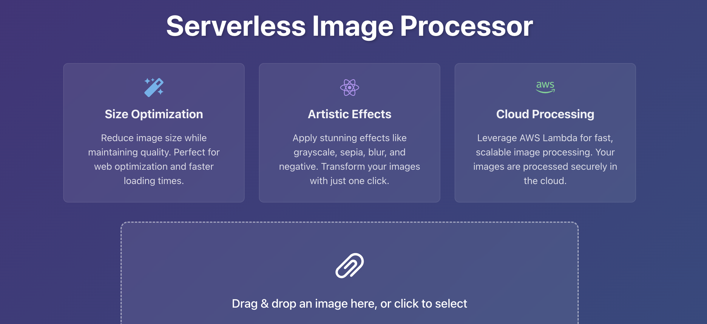

# Serverless Image Processing Application



## Live Demo
[Try the app here](https://d39tdha10id0k5.cloudfront.net)

## Overview
A modern, serverless image processing application built with React and AWS Lambda. This application allows users to upload images and apply various transformations while leveraging cloud infrastructure for scalable processing.

## Features
- **Secure Image Upload**: Upload images securely to AWS S3
- **Real-time Processing**: Process images instantly using AWS Lambda
- **Multiple Transformations**:
  - Size Optimization
  - Grayscale Effect
  - Sepia Tone
  - Blur Effect
  - Negative Effect
- **Cloud-Native Architecture**:
  - Serverless backend using AWS Lambda
  - S3 for storage
  - CloudFront for global content delivery
  - API Gateway for RESTful endpoints
- **Modern UI/UX**:
  - Responsive design using Chakra UI
  - Drag-and-drop file upload
  - Real-time processing status
  - Image preview functionality
- **Rate Limiting**: 5 image uploads per 6 hours

## Tech Stack
### Frontend
- React with TypeScript
- Vite for build tooling
- Chakra UI for components
- React Dropzone for file uploads
- Framer Motion for animations

### Backend
- AWS Lambda (Node.js 18.x)
- Sharp for image processing
- Serverless Framework
- AWS S3 for storage
- AWS CloudFront for CDN
- AWS API Gateway

## Local Development
1. Clone the repository
```bash
git clone <repository-url>
cd serverless-image
```

2. Install dependencies
```bash
# Install frontend dependencies
cd client
npm install

# Install backend dependencies
cd ../server
npm install
```

3. Configure environment variables
```bash
# Frontend (.env)
VITE_API_URL=your_api_url

# Backend (.env)
AWS_ACCESS_KEY_ID=your_access_key
AWS_SECRET_ACCESS_KEY=your_secret_key
REGION=your_aws_region
BUCKET_NAME=your_bucket_name
```

4. Run locally
```bash
# Start frontend
cd client
npm run dev

# Deploy backend
cd ../server
serverless deploy
```

## Deployment
The application is deployed using:
- Frontend: AWS S3 + CloudFront for global HTTPS delivery
- Backend: AWS Lambda + API Gateway
- Infrastructure: Managed via Serverless Framework

## Architecture
- **Client Layer**: React application served via CloudFront
- **API Layer**: API Gateway + Lambda functions
- **Processing Layer**: Lambda function with Sharp.js
- **Storage Layer**: S3 buckets for original and processed images

## Security Features
- HTTPS-only access via CloudFront
- Secure pre-signed URLs for S3 uploads
- IAM role-based access control
- Rate limiting on API endpoints
- Environment variable protection

## Performance Optimizations
- CloudFront CDN for global content delivery
- Image optimization during processing
- Efficient S3 bucket policies
- Serverless architecture for automatic scaling

## Contributing
1. Fork the repository
2. Create your feature branch (`git checkout -b feature/amazing-feature`)
3. Commit your changes (`git commit -m 'Add some amazing feature'`)
4. Push to the branch (`git push origin feature/amazing-feature`)
5. Open a Pull Request

## License
This project is licensed under the MIT License - see the [LICENSE](LICENSE) file for details.

## Acknowledgments
- [Serverless Framework](https://www.serverless.com/)
- [Sharp Image Processing](https://sharp.pixelplumbing.com/)
- [Chakra UI](https://chakra-ui.com/)
- AWS Services Documentation
